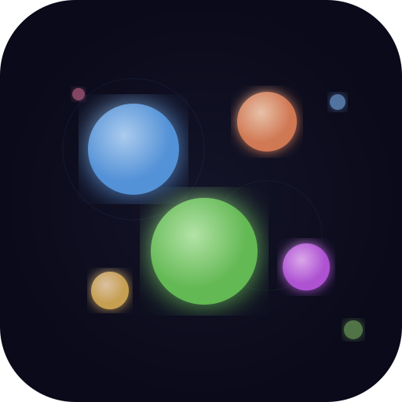

<p align="center">
  
</p>

<h1 align="center">Particle Flow</h1>

<p align="center">
  A meditative particle interaction experience for your browser.
</p>

<p align="center">
  <strong>Tap. Watch. Breathe.</strong>
</p>

---

Particle Flow is a zero-goal, ambient toy. Softly glowing orbs drift across a dark canvas, gently colliding and bouncing off one another in an endless, unhurried dance. There is nothing to win, nothing to lose — just a quiet space to slow down for a moment.

Touch a particle and it shifts colour, pulses with light, and grows or shrinks at random. An optional ambient soundscape — warm sine-wave drones layered with pentatonic melody fragments — loops every twenty seconds to deepen the calm.

## Features

- **Elastic physics** — particles bounce off walls and each other with mass-proportional responses
- **Touch & click** — tap particles to change their colour and nudge their size
- **Ambient audio** — a procedurally generated 20-second loop using the Web Audio API, muted by default
- **Installable PWA** — works offline, add it to your home screen on any device
- **Responsive** — fills the full viewport on desktop and mobile alike

## Getting Started

```bash
npm install
npm run dev
```

Open [http://localhost:5173/particle-flow/](http://localhost:5173/particle-flow/) in your browser.

### Production build

```bash
npm run build
npm run preview
```

## How It Works

### Particle Engine — `src/particles.js`

The simulation runs on an HTML Canvas. Each frame:

1. **Move** — every particle advances by its velocity vector
2. **Wall bounce** — particles reflect off screen edges
3. **Collision** — an O(n^2) pair check resolves overlaps with separation impulses weighted by mass (`radius^2`), producing natural-looking elastic collisions
4. **Draw** — each particle is rendered as a radial gradient with an optional glow halo that fades over time

Interaction is a proximity check: any particle within 50px of the tap point gets a new colour, a glow flash, a random size change (clamped between 4px and 40px), and a gentle push away from the touch.

### Audio — `src/audio.js`

Sound is generated entirely in the browser with the Web Audio API — no audio files are loaded. Two sine/triangle oscillators form a sustained C3 + G3 drone pad, while 10–15 short sine tones from a C-major pentatonic scale are scattered randomly across each 20-second cycle. Slight detuning between paired oscillators adds warmth.

### App Shell — `src/App.jsx`

A single React component wires the canvas, the animation loop, pointer events, and a mute toggle button together. The audio engine is only instantiated on the first unmute tap to satisfy browser autoplay policies.

### PWA — `vite.config.js`

`vite-plugin-pwa` generates the web manifest and a Workbox service worker that precaches all build assets, enabling full offline use after the first visit.

## Deployment

Push to `main` and the included GitHub Actions workflow (`.github/workflows/deploy.yml`) builds and deploys to GitHub Pages automatically.

## Tech Stack

| Layer | Technology |
|-------|-----------|
| UI | React 19 + HTML Canvas |
| Audio | Web Audio API |
| Build | Vite |
| PWA | vite-plugin-pwa + Workbox |
| Deploy | GitHub Pages + Actions |

## License

MIT
